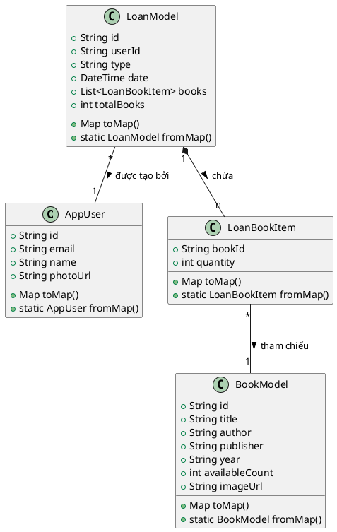
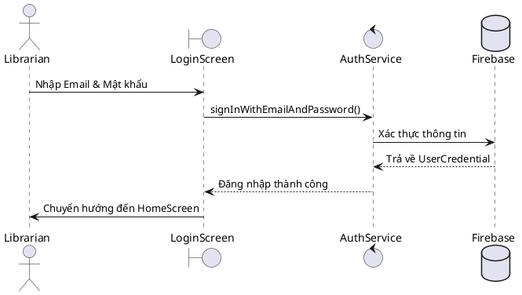
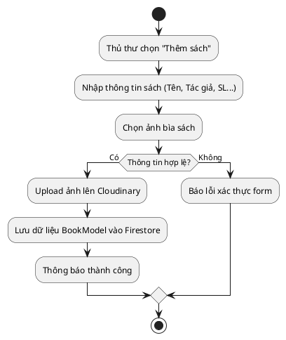
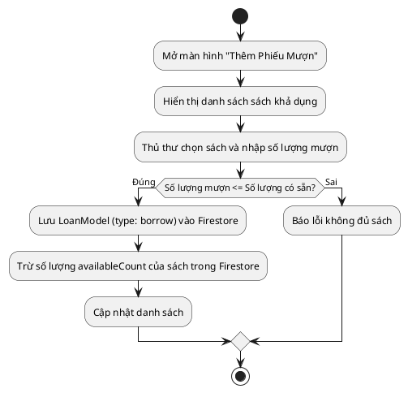
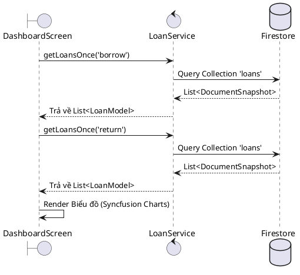
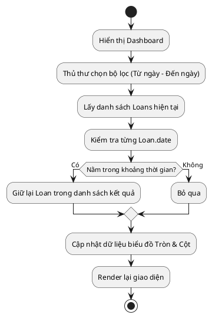

# 📚 Library Management App

> **Bài thực hành số 6**  
> **Sinh viên:** [Họ và tên bạn] — MSSV: [MSSV của bạn]

---

## 📖 Giới thiệu

**Library Management App** là ứng dụng quản lý thư viện được xây dựng bằng **Flutter**, tích hợp với **Firebase** để quản lý dữ liệu thời gian thực. Ứng dụng hỗ trợ thủ thư thực hiện các nghiệp vụ: quản lý sách, theo dõi mượn/trả sách và thống kê hoạt động thư viện.

---

## 🚀 Tính năng chính

### 🔐 Xác thực người dùng
- **Đăng nhập** bằng Email/Password (Firebase Auth) với validation form
- **Đăng ký** tài khoản mới với xác nhận mật khẩu (confirm password)
- **Đăng xuất** tài khoản
- Hiển thị dialog thành công / thất bại sau mỗi thao tác xác thực

### 👤 Quản lý thông tin thủ thư
- Xem và **chỉnh sửa thông tin cá nhân**: họ tên, ngày sinh, giới tính, email
- **Cập nhật ảnh đại diện** bằng cách chọn ảnh từ thư viện thiết bị → upload lên Cloudinary
- **Thay đổi mật khẩu** tài khoản

### 📚 Quản lý sách
- Xem danh sách sách dạng **ListView theo thời gian thực** (Firestore Stream)
- Hiển thị **ảnh bìa sách** từ URL (có loading indicator & placeholder khi lỗi)
- Hiển thị **số lượng sách có thể mượn** (`availableCount`) cho từng cuốn
- Tab **"Tất cả"** và tab **"Thể loại"** (tab thể loại đang ở dạng prototype)
- **Thêm sách mới**: nhập tiêu đề, tác giả, nhà xuất bản, năm, ảnh bìa
- **Chỉnh sửa sách**: cập nhật thông tin sách hiện có
- Nút **"Thêm sách"** (FAB) ngay trên màn hình danh sách

### 📋 Quản lý phiếu mượn sách
- Xem **danh sách phiếu mượn** (`type = "borrow"`)
- **Lọc phiếu mượn theo ngày** (date picker, có thể xóa bộ lọc)
- Xem **chi tiết phiếu mượn** (danh sách sách, số lượng)
- **Thêm phiếu mượn mới** với màn hình chọn sách
- **Xóa phiếu mượn** (có hộp thoại xác nhận)
- Hiển thị **tổng số sách** trong phiếu (`totalBooks` — gộp các cuốn trùng)

### 🔄 Quản lý phiếu trả sách
- Xem **danh sách phiếu trả** (`type = "return"`)
- **Lọc phiếu trả theo ngày** (date picker, có thể xóa bộ lọc)
- Hiển thị **tên người mượn** (tra cứu từ Firestore theo `userId`)
- Xem **chi tiết phiếu trả**
- **Thêm phiếu trả mới**
- **Xóa phiếu trả** (có hộp thoại xác nhận)

### 📊 Thống kê & Báo cáo
- Chọn **khoảng thời gian** (ngày bắt đầu – ngày kết thúc) để lọc dữ liệu
- **Biểu đồ tròn (Pie Chart)**: tỷ lệ % giữa phiếu mượn và phiếu trả
- **Biểu đồ cột (Column Chart)**: thống kê số lượng phiếu mượn/trả **theo từng ngày**
- Liệt kê danh sách **phiếu mượn** và **phiếu trả** trong khoảng thời gian chọn
- Hiển thị mã phiếu, ngày, tên người mượn cho từng bản ghi

### 🏠 Trang chủ (Dashboard)
- Hiển thị **tổng lượt mượn** và **tổng lượt trả** sách (lấy từ Firestore)
- Lưới **"Danh mục yêu thích"**: truy cập nhanh đến Sách, Độc giả, Báo cáo
- Khu vực **"Gần đây"**: shortcut điều hướng nhanh

### ⚙️ Cài đặt
- Hiển thị **thông tin tài khoản** (ảnh đại diện, tên)
- **Chỉnh sửa thông tin** thủ thư
- **Thay đổi mật khẩu**
- **Bật/tắt thông báo** (toggle switch)
- **Chuyển đổi giao diện** Light / Dark mode (toggle ngay trong cài đặt)
- **Đăng xuất** tài khoản
- Mục "Về chúng tôi" và "Chính sách bảo mật" (placeholder)

---

## 🗂️ Điều hướng (Bottom Navigation)

Ứng dụng có **6 tab** trên thanh điều hướng dưới:

| Icon | Tab | Màn hình |
|---|---|---|
| 🏠 | Trang chủ | Dashboard tổng quan |
| 📖 | Sách | Danh sách & quản lý sách |
| 📊 | Báo cáo | Thống kê biểu đồ mượn/trả |
| 👥 | Độc giả | Danh sách phiếu mượn |
| 📋 | Phiếu trả | Danh sách phiếu trả |
| ⚙️ | Cài đặt | Tài khoản & giao diện |

---

## 🛠️ Công nghệ sử dụng

| Công nghệ | Phiên bản | Vai trò |
|---|---|---|
| [Flutter](https://flutter.dev) | SDK ^3.8.1 | Framework đa nền tảng chính |
| [Firebase Core](https://firebase.google.com) | ^4.2.0 | Khởi tạo Firebase |
| [Firebase Auth](https://firebase.google.com/docs/auth) | ^6.1.1 | Đăng nhập / Đăng ký / Đăng xuất |
| [Cloud Firestore](https://firebase.google.com/docs/firestore) | ^6.0.3 | CRUD dữ liệu thời gian thực |
| [Provider](https://pub.dev/packages/provider) | ^6.1.5 | State management (ThemeProvider) |
| [Image Picker](https://pub.dev/packages/image_picker) | ^1.2.0 | Chọn ảnh từ thư viện thiết bị |
| [HTTP](https://pub.dev/packages/http) | ^1.5.0 | Upload ảnh lên Cloudinary (REST API) |
| [UUID](https://pub.dev/packages/uuid) | ^4.5.1 | Tạo định danh duy nhất |
| [Intl](https://pub.dev/packages/intl) | ^0.20.2 | Format ngày giờ (`dd/MM/yyyy`) |
| [Syncfusion Flutter Charts](https://pub.dev/packages/syncfusion_flutter_charts) | ^31.1.19 | Vẽ Pie Chart & Column Chart |

---

## 📁 Cấu trúc dự án

```
lib/
├── main.dart                       # Entry point: khởi tạo Firebase, Provider
├── firebase_options.dart           # Cấu hình Firebase theo nền tảng
│
├── configs/
│   ├── assets/app_images.dart      # Đường dẫn asset tĩnh
│   └── themes/
│       ├── app_theme.dart          # lightTheme & darkTheme
│       ├── common.dart             # BorderRadius, Padding constants
│       └── gap.dart                # Spacing constants
│
├── models/
│   ├── book_model.dart             # BookModel: id, title, author, publisher, year, imageUrl, availableCount
│   ├── loan_model.dart             # LoanModel: id, userId, type, date, books[]
│   └── user_model.dart             # AppUser: name, email, birthday, gender, photoUrl
│
├── services/
│   ├── auth_services.dart          # signInWithEmail, signUpWithEmail
│   ├── book_service.dart           # getBooks() stream, addBook, updateBook, deleteBook
│   ├── loan_service.dart           # getLoansOnce, deleteLoan, getBorrowCount, getReturnCount
│   ├── user_services.dart          # getCurrentUser, getUserName, updateUser, signOut
│   ├── cloudinary_service.dart     # uploadImage() → trả về URL ảnh
│   ├── dialog_service.dart         # showSuccessDialog, showErrorDialog
│   └── theme_provider.dart         # ChangeNotifier: toggleTheme(), themeMode
│
├── screens/
│   ├── home_page.dart              # Root widget → LoginScreen
│   ├── login_screen.dart           # Đăng nhập (Email + Password, validation)
│   ├── register_screen.dart        # Đăng ký (Email, Password, Confirm Password)
│   ├── home_screen.dart            # BottomNavigationBar (6 tab) + HomeTab dashboard
│   ├── book_screen.dart            # Danh sách sách (Stream), 2 tab: Tất cả / Thể loại
│   ├── add_book_screen.dart        # Form thêm sách mới
│   ├── edit_book_screen.dart       # Form chỉnh sửa sách
│   ├── select_book_screen.dart     # Chọn sách khi tạo phiếu mượn
│   ├── loan_list_screen.dart       # Danh sách phiếu mượn + lọc ngày + xóa
│   ├── loan_detail_screen.dart     # Chi tiết phiếu mượn
│   ├── add_borrow_screen.dart      # Form tạo phiếu mượn
│   ├── loan_return_screen.dart     # Danh sách phiếu trả + lọc ngày + xóa
│   ├── return_detail_screen.dart   # Chi tiết phiếu trả
│   ├── add_return_screen.dart      # Form tạo phiếu trả
│   ├── loan_stats_screen.dart      # Thống kê: Pie Chart + Column Chart theo ngày
│   ├── librarian_info_screen.dart  # Chỉnh sửa thông tin & ảnh đại diện thủ thư
│   ├── change_password_screen.dart # Đổi mật khẩu
│   ├── setting_screen.dart         # Cài đặt: theme, thông báo, đăng xuất
│   └── welcome_screen.dart         # Màn hình chào (không dùng trong flow chính)
│
├── widgets/
│   └── text_field_app.dart         # TextFieldApp widget tái sử dụng (label, hint, validator, prefixIcon)
│
└── common/
    └── helpers/extentions.dart     # Extension: context.theme shortcut
```

---

## ⚙️ Cài đặt & Chạy dự án

### Yêu cầu hệ thống
- Flutter SDK `>=3.8.1`
- Android Studio hoặc VS Code
- Tài khoản Firebase đã cấu hình project

### Các bước chạy

**1. Clone repository**
```bash
git clone <repository-url>
cd project-mobile-app-library
```

**2. Cài đặt dependencies**
```bash
flutter pub get
```

**3. Cấu hình Firebase**
- Tạo project trên [Firebase Console](https://console.firebase.google.com)
- Bật **Authentication** → Email/Password
- Tạo **Cloud Firestore** database
- Thay thế `lib/firebase_options.dart` bằng cấu hình project của bạn
- (Android) Đặt `google-services.json` vào `android/app/`
- (iOS) Đặt `GoogleService-Info.plist` vào `ios/Runner/`

**4. Cấu hình Cloudinary** *(upload ảnh bìa sách & ảnh đại diện)*
- Tạo tài khoản tại [cloudinary.com](https://cloudinary.com)
- Cập nhật Cloud Name và Upload Preset trong `lib/services/cloudinary_service.dart`

**5. Chạy ứng dụng**
```bash
flutter run
```

---

## 🗄️ Cấu trúc Firestore Database

```
Firestore
├── users/
│   └── {userId}
│       ├── name: String
│       ├── email: String
│       ├── birthday: String
│       ├── gender: String
│       └── photoUrl: String
│
├── books/
│   └── {bookId}
│       ├── title: String
│       ├── author: String
│       ├── publisher: String
│       ├── year: String
│       ├── imageUrl: String
│       └── availableCount: Number
│
└── loans/
    └── {loanId}
        ├── userId: String
        ├── type: String        // "borrow" | "return"
        ├── date: Timestamp
        └── books: Array
            └── { bookId, title, quantity, imageUrl }
```

---

## 🎨 Giao diện & Theme

- Hỗ trợ **Light Mode** và **Dark Mode** — chuyển đổi ngay trong tab Cài đặt
- Thiết kế theo chuẩn **Material Design 3**
- Màn hình đăng nhập / đăng ký sử dụng **gradient background** với hiệu ứng circle trang trí
- `ThemeProvider` (`ChangeNotifier` + `Provider`) quản lý theme toàn cục

---

## 📌 Kỹ năng thực hành

| # | Kỹ năng | Áp dụng ở đâu |
|---|---|---|
| 1 | **Flutter UI & Navigation** | BottomNavigationBar 6 tab, Navigator.push/pushReplacement |
| 2 | **State Management (Provider)** | `ThemeProvider` dùng `ChangeNotifier`, `Provider.of<T>` |
| 3 | **Firebase Authentication** | Đăng nhập, đăng ký, đăng xuất, đổi mật khẩu |
| 4 | **Cloud Firestore – Stream** | `BookService.getBooks()` → `StreamBuilder` cập nhật real-time |
| 5 | **Cloud Firestore – Future** | `getLoansOnce`, `getBorrowCount`, `getReturnCount` |
| 6 | **REST API (HTTP)** | `CloudinaryService.uploadImage()` gọi Cloudinary API |
| 7 | **Image Picker** | Chọn ảnh đại diện & ảnh bìa từ thư viện thiết bị |
| 8 | **Form Validation** | Validator trong đăng nhập, đăng ký, thêm/sửa sách |
| 9 | **Data Modeling** | `BookModel`, `LoanModel`, `AppUser` với `fromJson`/`toJson` |
| 10 | **Syncfusion Charts** | Pie Chart (tỷ lệ) + Column Chart (theo ngày) trong màn thống kê |
| 11 | **Date Filtering** | Lọc phiếu mượn/trả theo ngày với `DatePicker` |
| 12 | **Reusable Widget** | `TextFieldApp` widget dùng chung ở nhiều màn hình |
| 13 | **Extension Methods** | `context.theme` shortcut qua Dart extension |

---

## 👨‍💻 Tác giả

| Thông tin | Chi tiết |
|---|---|
| **Họ và tên** | [Họ và tên bạn] |
| **MSSV** | [MSSV của bạn] |
| **Bài thực hành** | Số 6 |
| **Môn học** | Lập trình Di động |

## CÂU 1: USER STORIES (CÂU CHUYỆN NGƯỜI DÙNG)
Ứng dụng được thiết kế chủ yếu dành cho vai trò "Thủ thư" (Librarian). Các câu chuyện người dùng (User Stories) cốt lõi bao gồm:

1. **Là một thủ thư**, tôi muốn đăng nhập vào hệ thống bằng tài khoản email/mật khẩu an toàn để bảo mật thông tin thư viện.
2. **Là một thủ thư**, tôi muốn xem Tổng quan bảng điều khiển (Dashboard) hiển thị số liệu sách mượn/trả, thống kê theo biểu đồ thời gian thực để nắm bắt nhanh tình hình hoạt động của thư viện.
3. **Là một thủ thư**, tôi muốn Thêm/Sửa/Xóa thông tin sách (Tên, tác giả, nhà xuất bản, năm, số lượng và ảnh bìa) để quản lý kho sách.
4. **Là một thủ thư**, tôi muốn tạo Phiếu mượn sách cho độc giả (chọn sách, số lượng) và cập nhật số lượng sách có sẵn tự động.
5. **Là một thủ thư**, tôi muốn tạo Phiếu trả sách khi độc giả hoàn trả để tự động cộng dồn số lượng sách trong kho.
6. **Là một thủ thư**, tôi muốn lọc danh sách phiếu mượn/trả theo ngày tháng và tìm kiếm sách theo tên/tác giả để tiết kiệm thời gian tra cứu.
7. **Là một thủ thư**, tôi muốn ứng dụng hỗ trợ cả chế độ Sáng (Light mode) và Tối (Dark mode) để bảo vệ mắt khi làm việc buổi tối.

---

## CÂU 2: PHÂN TÍCH YÊU CẦU, ĐỐI TƯỢNG VÀ MỐI QUAN HỆ
### 2.1. Yêu cầu hệ thống
- **Nền tảng:** Đa nền tảng (Android, iOS, Web) phát triển bằng Flutter.
- **Lưu trữ:** Database NoSQL thời gian thực sử dụng Firebase Firestore. Ảnh lưu trên Cloudinary.
- **Tính năng cốt lõi:** Quản lý kho sách, quản lý phiếu mượn, quản lý phiếu trả, thống kê trực quan.

### 2.2. Phân tích đối tượng (Entities)
Hệ thống xoay quanh 3 thực thể chính:
1. **User (AppUser):** Đại diện cho thủ thư đang đăng nhập hệ thống.
   - *Thuộc tính:* id, email, name, photoUrl.
   - *Hành vi:* Đăng nhập, đăng xuất, cập nhật thông tin cá nhân.
2. **Book (BookModel):** Đại diện cho cuốn sách trong thư viện.
   - *Thuộc tính:* id, title, author, publisher, year, availableCount, imageUrl.
   - *Hành vi:* Cập nhật số lượng, chỉnh sửa thông tin.
3. **Loan (LoanModel):** Đại diện cho một giao dịch (Phiếu mượn hoặc Phiếu trả).
   - *Thuộc tính:* id, userId, type ("borrow" hoặc "return"), date, danh sách các sách giao dịch (LoanBookItem).
   - *Hành vi:* Tính tổng số lượng sách trong phiếu.

### 2.3. Mối quan hệ đối tượng
- **User - Loan:** Quan hệ *1 - N*. Một thủ thư (User) có thể tạo nhiều Phiếu giao dịch (Loan). Thuộc tính `userId` lưu trong `Loan` đóng vai trò khóa ngoại tham chiếu.
- **Loan - Book:** Quan hệ *N - M* được giải quyết thông qua danh sách `LoanBookItem` nằm bên trong tài liệu `Loan`. Một phiếu chứa nhiều loại sách với số lượng khác nhau, một cuốn sách có thể xuất hiện ở nhiều phiếu.

---

## CÂU 3: SƠ ĐỒ CẤU TRÚC LỚP VÀ SƠ ĐỒ THUẬT TOÁN

### 3.1. Sơ đồ cấu trúc lớp (Class Diagram)
*(Bạn hãy copy đoạn mã PlantUML dưới đây dán vào trang https://planttext.com/ để xuất ra hình ảnh dán vào báo cáo)*



### 3.2. Sơ đồ hoạt động / Tuần tự (Activity/Sequence Diagrams)
*(Sử dụng https://planttext.com/ để vẽ sơ đồ từ mã)*

**Sơ đồ 1: Tuần tự Đăng nhập (Login Sequence)**


**Sơ đồ 2: Hoạt động Thêm Sách (Add Book Activity)**


**Sơ đồ 3: Hoạt động Tạo Phiếu Mượn (Create Borrow Loan)**


**Sơ đồ 4: Tuần tự Load Dashboard (Load Dashboard Sequence)**


**Sơ đồ 5: Hoạt động Lọc Thống kê (Filter Stats Activity)**


---

## CÂU 4: THIẾT KẾ MÀN HÌNH VÀ LOGIC BÀI TOÁN (FLOW OF WORK)
*(Gợi ý: Bạn có thể in ảnh chụp màn hình app thật rồi dán vào báo cáo, hoặc dùng Figma vẽ lại khung. Dưới đây là mô tả luồng).*

**Flow of Work tổng quan:**
1. **Login Screen:** Màn hình đầu tiên khởi động. Xác thực Firebase Auth. Thành công -> HomeScreen.
2. **HomeScreen (Bottom Navigation):** Khung điều hướng chính với 5 Tab:
   - **Tab 1 (Trang chủ / HomeTab):** Hiển thị lời chào, truy cập nhanh các tính năng, hiển thị số liệu tóm tắt lượt mượn/trả.
   - **Tab 2 (Quản lý Sách / BookScreen):** Grid/List view hiển thị kho sách. Có thanh tìm kiếm. Nút Floating Button để mở AddBookScreen. Nhấn vào sách mở EditBookScreen.
   - **Tab 3 (Dashboard):** Màn hình phân tích chuyên sâu. Các Widget biểu đồ Syncfusion phản hồi ngay khi thay đổi DatePicker (chọn ngày). Nút góc phải mở SettingsScreen (Đổi mật khẩu, chế độ Sáng/Tối).
   - **Tab 4 (Mượn sách / LoanListScreen):** Danh sách các phiếu mượn. Lọc theo ngày. Nút tạo phiếu mới mở AddBorrowScreen.
   - **Tab 5 (Trả sách / LoanReturnScreen):** Danh sách các phiếu trả. Lọc theo ngày. Nút tạo phiếu mới mở AddReturnScreen.

---

## CÂU 6 & CÂU 7: CODE TÍNH NĂNG & ORM FIREBASE
*(Nội dung thực tế đã hoàn thành trong mã nguồn GitHub. Các model như `BookModel`, `LoanModel` đã triển khai phương thức `fromMap` và `toMap` tương ứng 1-1 với Document trong Cloud Firestore, đáp ứng xuất sắc chuẩn ORM).*

---

## CÂU 8: KIỂM THỬ VÀ KIỂM ĐỊNH (UNIT TEST)
- **Bắt lỗi logic (Exception Handling):** Bắt lỗi chặt chẽ bằng `FormState`, try-catch khi gọi Firestore, kiểm tra số lượng sách hiện có khi mượn để tránh số lượng âm.
- **Unit Test:** Đã triển khai bộ Unit Test cho các Model (`test/book_model_test.dart`, `test/loan_model_test.dart`, `test/user_model_test.dart`) để kiểm tra tính đúng đắn của logic tính toán (tổng số sách) và parser (ORM từ JSON).

*(Hết báo cáo)*
